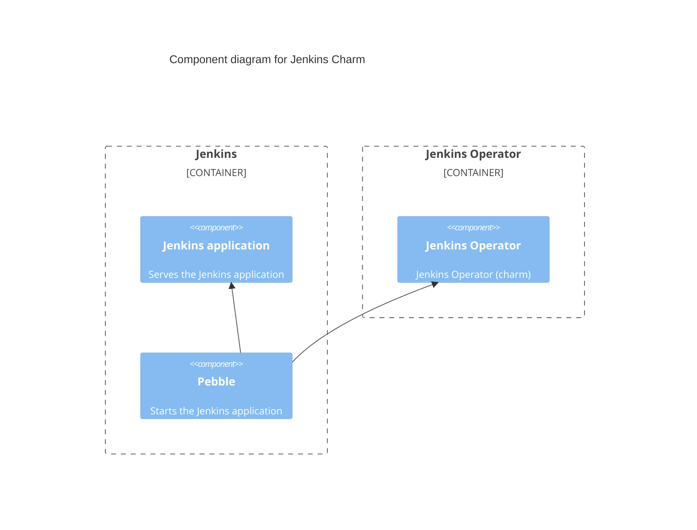

# Charm architecture

The jenkins-k8s charm aims to provide core functionalities of Jenkins with horizontally
scalable architecture, leveraging its flexible capabilities enhanced by plugins. Operational
capabilities are enhanced through integration with the
Canonical Observability Stack ([COS](https://charmhub.io/topics/canonical-observability-stack/))
charms.

## Containers

The core component of jenkins-k8s charm consists of a jenkins-k8s main workload container. The
services inside the container are driven by Pebble, a lightweight API-driven process supervisor
that controls the lifecycle of a service.
Learn more about Pebble and its layer configurations [in the Pebble documentation](https://github.com/canonical/pebble).

### Jenkins

This container runs the main workload of the charm. The OCI image is custom built and includes
the [Jenkins WAR](https://www.jenkins.io/doc/book/installing/war-file/), Java and the [Jenkins plugin installation manager](https://github.com/jenkinsci/plugin-installation-manager-tool/).

To facilitate monitoring of the Jenkins application via the COS, the [prometheus](https://plugins.jenkins.io/prometheus/) plugin is installed by default. The [instance-identity](https://plugins.jenkins.io/instance-identity/) plugin is also included to ensure seamless registration of agent nodes. Additionally, the [monitoring](https://plugins.jenkins.io/monitoring/) plugin is pre-installed to handle session invalidation.

When a logging relation is joined, a promtail application is started via Pebble which starts
pushing Jenkins logs at `/var/lib/jenkins/logs/jenkins.log` to Loki.
The metrics are also scraped via accessing the `/metrics` endpoint of the Jenkins application.

### charm

This container is the main point of contact with the Juju controller. It communicates with Juju to
run necessary charm code defined by the main `src/charm.py`. The source code is copied to the
`/var/lib/juju/agents/unit-UNIT_NAME/charm` directory.

## OCI image

The jenkins-image is custom built to include Jenkins as well as its plugin installation manager. Since Jenkins is
an application running on Java, required libraries and dependencies are installed during the build
process.

Jenkins application installation is done at runtime during container pebble ready step.

Currently, Jenkins version 2.492.2 is used alongside Ubuntu 22.04 base image.

## Integrations

See [Relation endpoints](../reference/integrations.md).

### Peer relations

Only one deployment per Jenkins application is supported.

## Juju events

Juju events allow progression of the charm in its lifecycle and encapsulates part of the execution
context of a charm. Below is the list of observed events for `jenkins-k8s charm` with how the charm
reacts to the event. For more information about the charm’s lifecycle in general, refer to the
charm’s life [documentation](https://canonical-juju.readthedocs-hosted.com/en/3.6/user/reference/hook/).

### jenkins_pebble_ready

This event signals that the Pebble inside the workload container is ready. The charm then starts interacting with Pebble to begin the installation process.

### _on_jenkins_home_storage_attached

This event marks the charm’s storage availability. The name of the event derived from the name of
the storage noted in the `metadata.yaml` configuration under "storage" key.
`containers.jenkins.mounts.storage` and `storage.jenkins-home` section. The storage filesystem maps to
`/var/lib/jenkins` directory of the Jenkins application, which is used to store Jenkins related files.

### _on_update_status

This event is fired regularly by Juju to check the status of the charm. The charm checks if any plugins outside of the configured plugins (through charm configuration) have been installed and removes them.

### agent_relation_joined

When an agent joins the relation, the charm registers the Jenkins agent node to the Jenkins application and starts orchestrating it.

### agent_relation_departed

When an agent departs the relation, the charm unregisters the Jenkins agent node from the Jenkins application.

## Charm code overview

The `src/charm.py` is the default entry point for a charm and has the JenkinsK8sOperatorCharm Python class which inherits from CharmBase.

CharmBase is the base class from which all Charms are formed, defined by [Ops](https://juju.is/docs/sdk/ops) (Python framework for developing charms).

> See more in the Juju docs: [Charm](https://canonical-juju.readthedocs-hosted.com/en/3.6/user/reference/charm/).

The `__init__` method guarantees that the charm observes all events relevant to its operation and handles them.
